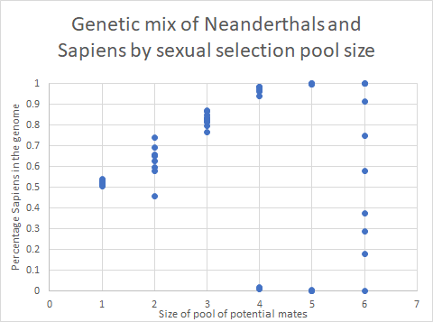
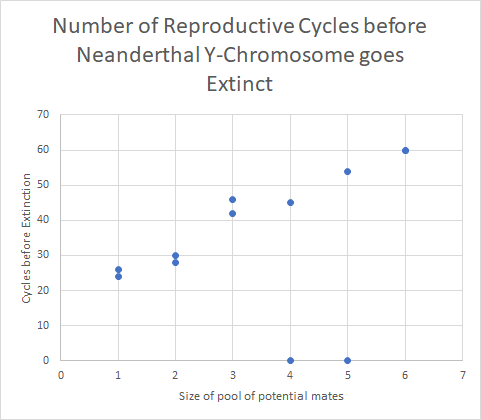
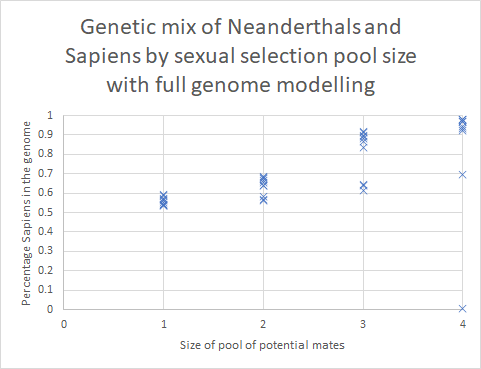
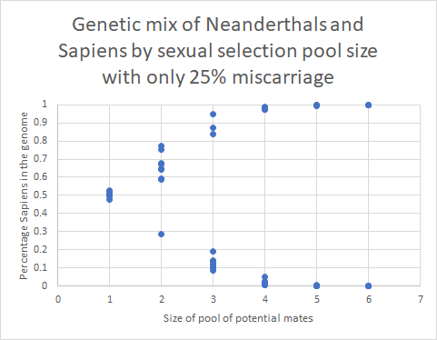

# Neanderthals
_Simulating a mixed population of Neanderthals and Sapiens_.

## Abstract
Neanderthals have lived in Europe since around 450,000 years ago. Some 70,000 years ago, Homo Sapiens arrived in Europe and interacted with the Neanderthals. Today, the Neanderthal Y-chromosome, which passes exclusively through the male line, appears to be completely extinct. Among Europeans, the genome typically has 1.5% to 4% of Neanderthal DNA: the Sapiens ancestors greatly predominate over the Neanderthal ancestors.

Why did Sapiens survive and Neanderthals did not, despite being at least as strong and cold-adapted, and probably as intelligent? There are many theories, most of which suggest that Sapiens have more Darwinian fitness than Neanderthals -- for example their toolsets are better, or their culture and organisation allowed them to outcompete or even exterminate the Neanderthals.

In 2016, a paper by Mendez, Poznik, Castellano and Bustamante (https://www.cell.com/ajhg/fulltext/S0002-9297(16)30033-7) claimed that Neanderthal Y-chromosomes had gone extinct because they were incompatible with some Sapiens genes, and would result in miscarriages if Sapiens women were pregnant carrying Neanderthal boys.

Is it possible that this miscarriage effect could alone account for the current admixture of Neanderthal/Sapiens DNA, without any need for other Darwinian fitness differences between the species?

This computer program allows us to test this hypothesis. It uses Monte-Carlo simulations of a mixture of the two species, and reports the final genetic composition.

Reasonable modelling assumptions, exactly symmetric between Sapiens and Neanderthal apart from the miscarriages, do indeed result in genetic compositions in line with those seen in modern white Europeans, as can be seen by running the program with its default parameters.

## List of files
* `evolve.py` The simple algorithm, implemented in python. To execute it, run `python evolve.py`
* `evolve_with_male_selection.py` Modified algorithm that allows males rather than females to do the choosing
* `evolve_multi_gene.py` Algorithm rewritten to handle Mendel's laws correctly. Runs more slowly
* `results.xlsx` Excel spreadsheet showing the results of the algorithm, and tests that examine the assumptions
* `README.md` This file

## Assumptions
It would be unfeasible to try to exactly model the interaction between Neanderthals and Sapiens. We do not have the detailed knowledge or the computer time. Moreover, many of the details, such as the nature of the sexual interaction are unlikely to affect the final genetic composition very significantly.

The approach we take is very simple. There is a single mixed population of individuals. The starting state can be chosen, but defaults to equal numbers of male/female Sapiens/Neanderthals, all of whom are initially pure-bred. Each individual is represented by a percentage, representing the proportion of Sapiens genes. Whether individuals are male or female, and whether they carry the Neanderthal Y-chromosome, are represented by keeping these individuals in different lists.

We want to avoid individuals living indefinitely, and this is achieved simply by ordering the lists by age, killing those at the head of the list first to keep the population within predefined limits.

Sexual selection is really important, as can be seen by the results below. Without any sexual selection, the Neanderthal Y-chromosome goes extinct quite quickly but does not take much of the Neanderthal genome with it. We make the assumption that reproduction can be represented as cycles, with all females of reproductive age bearing one offspring in each cycle, unless it miscarries. Every female participates in reproduction but not every male -- some males father multiple offspring and some father none at all. This is represented by each female selecting a male. This satisfies the participation requirements but seems anthropologically unrealistic. We plan to investigate the impact of this assumption.

The method of sexual selection is to allow each female to choose from a small randomly chosen pool of males. She picks the most attractive, which is defined as the one whose genetic mix most closely matches the closest species to her own. Thus a female with more Neanderthal genes than Sapiens, presented with a pool of mixed species males, would pick the one with the most Neanderthal genes.

## Results
The folowing graph shows the results of sixty test runs, 10 each with pool sizes from 1 to 6, using the assumptions detailed above.

You can see that when there is no sexual selection (pool size = 1), the final mixture of Sapiens/Neanderthal genes is roughly 50/50. However, larger pool sizes, meaning more sexual selection, result in a clearer split. When the pool size is very large, such as 10 (not shown on this graph), the two species remain completely separate, there are no miscarriages, and eventually one species or the other goes extinct just due to random noise. With intermediate pool sizes, there is some sexual selection but some mixing. Most runs end up with mainly Sapiens genes, though a few of the runs end up with mainly Neanderthal genes. In other words, one species or the other goes extinct, and it is usually Neanderthals. A pool size of 3 results in genomes that range from 77% to 87% Sapiens. A pool size of 4 results in genomes that range from 94% to 98% Sapiens. By the time we get to a pool size of 6, the species remain distinct and in most cases neither species has gone extinct in the lifetime of the test, resulting in a wide variety of genes.

In 44 tests out of the 50 with pool sizes less than 6, the Neanderthal Y-chromosome went extinct. The following graph shows how long this took for each of the tests, split up by the size of the sexual selection pool.

The cases where the Neanderthal Y-chromosome did not go extinct are shown by a zero on the graph. For small sexual selection pools, the Neanderthal Y-chromosome goes extinct quite quickly -- around 25 reproductive cycles. As the pool size increases, the two species stay distinct for longer, and the time to extinction rapidly increases, to between around 60 cycles for a pool size of 6.

## Explanation
It is easy to see how the Neanderthal Y-chromosome quickly goes extinct when we allow cross breeding. For example, consider population of one Neanderthal male and female, and one Sapiens male and female. There are four possible pairings, each producing either a male or female, which result in the following 7 potential offspring: 100% Sapiens male (Sapiens Y), 100% Sapiens female, 50% Sapiens male (Sapiens Y), 50% Sapiens female from two different pairings, 100% Neanderthal male (Neanderthal Y), 100% Neanderthal female. The missing one is a 50% Sapiens male with Neanderthal Y-chromosome, which would miscarry.

Averaging across all the possible male offspring, the probability of producing a boy with Sapiens Y-chromosome is 2/3, but the probability of producing a boy with Neanderthal Y-chromosome is only 1/3, assuming all the possibilities are equally likely. Thus, in the absence of sexual selection, the relative number of Neanderthal to Sapiens Y chromosomes halves in every generation. Small wonder that it rapidly goes extinct.

When there is sexual selection, the probabilities of mixed-species offspring decrease. In the extreme, where Sapiens and Neanderthals never mate, there is no chance of miscarriage, and the Neanderthal Y-chromosome is as long-lived as the Sapiens. In intermediate cases, Neanderthal Y-chromosomes go extinct, but not as quickly as halving every generation.

Consider now the other genes in the genome. When all 7 offspring are equally probable, there are two pure Sapiens, two pure Neanderthal, and three 50% mixes. The overall expectation is 50%. The second generation, however, is not so balanced. I shall not enumerate all the options, but there are now eleven possible offspring, and the 75% Sapiens male is not completely matched by the 75% Neanderthal male, which has a 50% chance of miscarriage. The overall expectation is now slightly biased towards Sapiens.

Sexual selection has two effects. It tends to pull any solution strongly towards one side or the other, and it keeps the Neanderthal Y-chromosome alive for longer, so the pro-sapiens bias lasts for more generations. The net result is that this slight bias towards Sapiens turns into a final stable distribution that is strongly Sapiens in most cases.

## Examining the assumptions
Here we list some of the more eggregious assumptions made in the model, and describe experiments that help to justify those assumptions.

### Sexual selection by females only
When a woman is made pregnant, she is taken out of circulation for that reproductive cycle, but a man is able to mate with others. Thus it is easiest to iterate through the list of women, allowing each to pick the most attractive man from some randomly chosen pool. However, this does not fit very closely with reality, where sexual selection is performed by both sexes, and indeed some women are not made pregnant at all.

I experimentally changed the algorithm to randomly select men, who would then pick the most attractive woman from a pool. I also needed to reduce the number of women actually getting pregnant, otherwise the selection ended up being forced so that all women are chosen. With this change, I get exactly the same form of results as when the selection is done by women.

Given that the extremes give the same results, it seems reasonable that more realistic and complex methods of selection would also give similar results.

### Only killing the oldest individuals
The simple algorithm just kills the oldest individuals to keep the overall population size, separately for men and women, constant. The opposite extreme would be to kill individuals at random, ignoring the age and gender. When I implemented this scheme, again the results had the same form. Given the behaviour of these extremes, I would expect that more realistic intermediate algorithms, killing some individuals at random, and allowing old age to kill others, would behave the same way.

### Simplistic treatment of genetics
The algorithm treats the genome as a percentage, between 0% (pure Neanderthal) and 100% (pure Sapiens). In reality, a genome has many independent genes arranged in pairs, where one of each pair is randomly selected and passed to the offspring. Some genes affect appearance and behaviour, which may affect sexual attractiveness. Some genes affect how much the holder fancies particular aspects of appearance or behaviour, which also affects sexual selection. Some genes affect the likelihood of miscarriage in the presence of Neanderthal Y-chromosomes. Many genes differ between Neanderthals and Sapiens but have no impact on sexual selection or miscarriage.

I rewrote the algorithm so it handled the genetics far more accurately. The new algorithm correctly implements Mendel's rules, though there are simplifications: the numbers of genes are small; we assume one-to-one mapping between appearance genes and the genes that control whether these are seen as attractive; we assume that the phenotype is differently affected by all three possible states of the two genes, and that these act monotonically (Sapiens/Neanderthal cross lies between pure Sapiens and pure Neanderthal).

With these changes, the algorithm is more complicated and runs extremely slowly. For example, it is only feasible to run with small sexual selection pool sizes. However, the results have the same form as the simplistic modelling of genes as percentages, as can be seen in the following graph.

You can see from these results that there is more noise in the convergence. This is reduced by increasing the number of genes in each category (the test had just 20 pairs in each of appearance, desire, miscarriage and others) though this slows down the test. Even so, the great majority of tests follow the same pattern as the simplistic model, with 92% to 98% Sapiens genes with a sexual selection pool size of 4.

### No spatial/geographic modelling
The algorithm ignores the spatial position of any of the individuals in the population, except that the sexual selection pool size partly represents spatial segregation into small groups.

Reality must have been far more complex. A relatively small group of Sapiens entered the territory of the Neaderthals, though we currently know nothing of how often they met or how they interacted, apart from the genetic evidence. Were there neighboring tribes of Sapiens and Neanderthals? Most likely, there were areas that were pure Sapiens and pure Neanderthal, with some border areas of interaction and cross-breeding. The effect of this cross-breeding would diffuse through the remainder of the population. Periodic resource pressure, such as ice ages, would cause some isolated populations to die out and some long-distance migration. There was probably violence between Neanderthal and Sapiens, as well as intra-species conflict.

It is impossible to know, let alone model, the details of the geosocial interaction, but we can model some extreme cases, as a counterpoint to the unlimited interaction model already tested. This remains a research project.

### Assumptions about miscarriages
The algorithm assumes that every pregnant Sapiens woman carrying a boy with Neanderthal Y-chromosomes has a miscarriage, and that is the only impact of Neaderthal Y-chromosomes. The paper by Mendez, Poznik, Castellano and Bustamante offers a number of possible causes of extinction of the Y-chromosomes, including subsequent miscarriages in a Sapiens woman who has carried Neanderthal Y-chromosomes, or even subsequent births of homosexual offspring.

I first experimented with reducing the probability of miscarriage. The following graph shows what happens if there is only a 25% chance of a miscarriage when a Sapiens woman carries a foetus with Neanderthal Y-chromosomes.

It now takes, on average, more than three times as long for the Neanderthal Y-chromosome to go extinct (111 reproductive cycles rather than 34), even when it does at all. In 23 of 60 test runs, the Y-chromosome did not go extinct within 1000 cycles. If we ignore these cases, the percentage Sapiens in the genome when the pool size is 4 ranges from 97% to 99%. Thus the same form of results appears, just less reliably and taking longer.

The other ideas in the Mendez, Poznik, Castellano and Bustamante are harder to evaluate, as they require assumptions about how males and females form relationships. If a female Sapiens becomes more likely to have miscarriages or homosexual offspring after mating with a Neanderthal male, is this more likely to affect subsequent offspring of that Neanderthal, other Neanderthals, or partners of any species. It depends whether relationships are monogamous, exogamous or other types. If relationships tend to be monogamous or with kin of an original partner, which seems a reasonable assumption, the effect will be to further reduce the offspring of male Neanderthals and female Sapiens.
