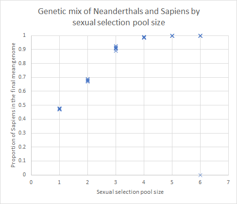

# Neanderthals
_Simulating a mixed population of Neanderthals and Sapiens_.

## Abstract
Neanderthals have lived in Europe since around 450,000 years ago. Some 70,000 years ago, Homo Sapiens arrived in Europe and interacted with the Neanderthals. Today, the Neanderthal Y-chromosome, which passes exclusively through the male line, appears to be completely extinct. Among Europeans, the genome typically has 1.5% to 4% of Neanderthal DNA: the Sapiens ancestors greatly predominate over the Neanderthal ancestors.

Why did Sapiens survive and Neanderthals did not, despite being at least as strong and cold-adapted, and probably as intelligent? There are many theories, most of which suggest that Sapiens have more Darwinian fitness than Neanderthals -- for example their toolsets are better, or their culture and organisation allowed them to outcompete or even exterminate the Neanderthals.

In 2016, a paper by Mendez, Poznik, Castellano and Bustamante (https://www.cell.com/ajhg/fulltext/S0002-9297(16)30033-7) claimed that Neanderthal Y-chromosomes had gone extinct because they were incompatible with some Sapiens genes, and would result in miscarriages if Sapiens women were pregnant carrying Neanderthal boys.

Is it possible that this miscarriage effect could alone account for the current admixture of Neanderthal/Sapiens DNA, without any need for other Darwinian fitness differences between the species?

This computer program allows us to test this hypothesis. It uses Monte-Carlo simulations of a mixture of the two species, and reports the final genetic composition.

Reasonable modelling assumptions, exactly symmetric between Sapiens and Neanderthal apart from the miscarriages, do indeed result in genetic compositions in line with those seen in modern white Europeans, as can be seen by running the program with its default parameters.

## Assumptions
It would be unfeasible to try to exactly model the interaction between Neanderthals and Sapiens. We do not have the detailed knowledge or the computer time. Moreover, many of the details, such as the nature of the sexual interaction -- rape/monogamy/promiscuity/... -- are unlikely to affect the final genetic composition very significantly.

The approach we take is very simple. There is a single mixed population of individuals. The starting state can be chosen, but defaults to equal numbers of male/female Sapiens/Neanderthals, all of whom are initially pure-bred. Each individual is represented by a single floating point number between zero and one, representing the proportion of Sapiens genes. Whether individuals are male or female, and whether they carry the Neanderthal Y-chromosome, are represented by keeping these individuals in different lists.

We want to avoid individuals living indefinitely, and this is achieved simply by ordering the lists by age, killing those at the head of the list first to keep the population within predefined limits.

Sexual selection is really important, as can be seen by the results below. Without any sexual selection, the Neanderthal Y-chromosome goes extinct quite quickly but does not take much of the Neanderthal genome with it. We make the assumption that reproduction can be represented as cycles, with all females of reproductive age bearing one offspring in each cycle, unless it miscarries. Every female participates in reproduction but not every male -- some males father multiple offspring and some father none at all. This is represented by each female selecting a male. This satisfies the participation requirements but seems anthropologically unrealistic. We plan to investigate the impact of this assumption.

The method of sexual selection is to allow each female to choose from a small randomly chosen pool of males. She picks the most attractive, which is defined as the one whose genetic mix most closely matches the closest species to her own. Thus a female with more Neanderthal genes than Sapiens, presented with a pool of mixed species males, would pick the one with the most Neanderthal genes.

Originally, we tried a sexual selection technique which matched the male who most closely matched the female in proportion. For example, a 75% Sapiens female would try to find a 75% Sapiens male. This method does work, but less well, and it is further from reality. In practice, a 75% Sapiens female will be attracted by 75% of Sapiens traits and 25% Neanderthal, but there is no guarantee that those traits will be the same as in some random 75% Sapiens male. The closest match would be a fully Sapiens male, with a guaranteed 75% match -- greater than the average match for any mixed species male.

As a technical point, it ought not to matter whether we class a 50% individual as a Sapiens or a Neanderthal, as exactly 50% should almost never happen. In these tests, however, exactly 50% is quite common, particularly at the start of the test runs. I experimented with assigning the 50% individuals in both possible directions -- it made no difference to the form of the final result.

## Results
The folowing graph shows the results of sixty test runs, 10 each with pool sizes from 1 to 6, using the assumptions detailed above.

You can see that when there is no sexual selection (pool size = 1), the final mixture of Sapiens/Neanderthal genes is roughly 50/50. However, larger pool sizes, meaning more sexual selection, result in a clearer split. When the pool size is very large, such as 10 (not shown on this graph), the two species remain completely separate, there are no miscarriages, and eventually one species or the other goes extinct just due to random noise. With intermediate pool sizes, there is some sexual selection but some mixing. Most runs end up with mainly Sapiens genes, though one outlier run ends up with mainly Neanderthal genes. In other words, one species or the other goes extinct, and it is usually Neanderthals. A pool size of 3 results in genomes that range from 89% to 93% Sapiens. A pool size of 4 results in genomes that range from 98% to 99% Sapiens.

In all test runs bar one, the Neanderthal Y-chromosome went extinct. The following graph shows how long this took for each of the tests, split up by the size of the sexual selection pool:

The one case where the Neanderthal Y chromosome did not go extinct is shown by a zero on the graph. For small sexual selection pools, the Neanderthal Y-chromosome goes extinct quite quickly -- around 20 reproductive cycles. As the pool size increases, the two species stay distinct for longer, and the time to extinction rapidly increases, to between 60 and 100 reproductive cycles for a pool size of 6.

## Explanation
It is easy to see how the Neanderthal Y-chromosome quickly goes extinct when we allow cross breeding. For example, consider population of one Neanderthal male and female, and one Sapiens male and female. There are four possible pairings, each producing either a male or female, which result in the following 7 potential offspring: 100% Sapiens male (Sapiens Y), 100% Sapiens female, 50% Sapiens male (Sapiens Y), 50% Sapiens female from two different pairings, 100% Neanderthal male (Neanderthal Y), 100% Neanderthal female. The missing one is a 50% Sapiens male with Neanderthal Y chromosome, which would miscarry.

Averaging across all the possible male offspring, the probability of producing a boy with Sapiens Y chromosome is 2/3, but the probability of producing a boy with Neanderthal Y chromosome is only 1/3, assuming all the possibilities are equally likely. Thus, in the absence of sexual selection, the relative number of Neanderthal to Sapiens Y chromosomes halves in every generation. Small wonder that it rapidly goes extinct.

When there is sexual selection, the probabilities of mixed-species offspring decrease. In the extreme, where Sapiens and Neanderthals never mate, there is no change of miscarriage, and the Neanderthal Y chromosome is as long-lived as the Sapiens. In intermediate cases, Neanderthal Y chromosomes go extinct, but not as quickly as halving every generation.

Consider now the other genes in the genome. When all 7 offspring are equally probable, there are two pure Sapiens, two pure Neanderthal, and three 50% mixes. The overall expectation is 50%. The second generation, however, is not so balanced. I shall not enumerate all the options, but there are now eleven possible offspring, and the 75% Sapiens male is not completely matched by the 75% Neanderthal male, which has a 50% chance of miscarriage. The overall expectation is now slightly biased towards Sapiens.

Sexual selection has two effects. It tends to pull any solution strongly towards one side or the other, and it keeps the Neanderthal Y-chromosome alive for longer, so the pro-sapiens bias lasts for more generations. The net result is that this slight bias towards Sapiens turns into a final stable distribution that is strongly Sapiens.
